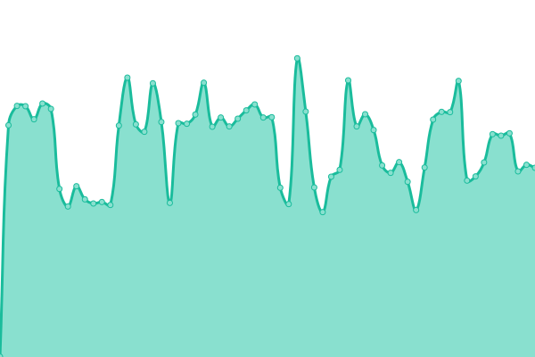
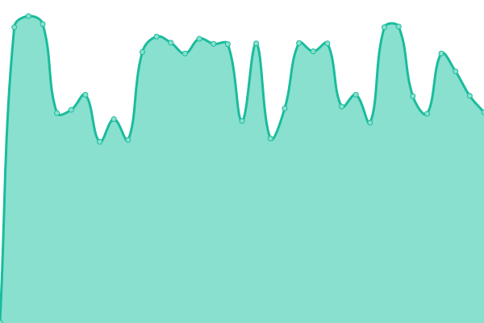

# [📈 Live Status](https://demo.upptime.js.org): <!--live status--> **🟩 All systems operational**

This repository contains the open-source uptime monitor and status page for [Upptime](https://upptime.js.org), powered by [Upptime](https://github.com/upptime/upptime).

With [Upptime](https://upptime.js.org), you can get your own unlimited and free uptime monitor and status page, powered entirely by a GitHub repository. We use [Issues](https://github.com/upptime/upptime/issues) as incident reports, [Actions](https://github.com/exploswell/upptime/actions) as uptime monitors, and [Pages](https://demo.upptime.js.org) for the status page.

<!--start: status pages-->
<!-- This summary is generated by Upptime (https://github.com/upptime/upptime) -->
<!-- Do not edit this manually, your changes will be overwritten -->
<!-- prettier-ignore -->
| URL | Status | History | Response Time | Uptime |
| --- | ------ | ------- | ------------- | ------ |
|  [WhatsApp_Graph_RU](https://aksigano.com/response.html) | 🟩 Up | [whats-app-graph-ru.yml](https://github.com/exploswell/upptime/commits/HEAD/history/whats-app-graph-ru.yml) | 

 626ms
     
 | 

<a href="https://exploswell.github.io/upptime/history/whats-app-graph-ru">100.00%</a>
    

|  [WhatsApp_Graph_RU](https://bdnuresult.com/response.html) | 🟩 Up | [whats-app-graph-ru.yml](https://github.com/exploswell/upptime/commits/HEAD/history/whats-app-graph-ru.yml) | 

 626ms
     
 | 

<a href="https://exploswell.github.io/upptime/history/whats-app-graph-ru">100.00%</a>
    

|  [WhatsApp_Graph_RU](https://costkutters.com/response.html) | 🟩 Up | [whats-app-graph-ru.yml](https://github.com/exploswell/upptime/commits/HEAD/history/whats-app-graph-ru.yml) | 

 626ms
     
 | 

<a href="https://exploswell.github.io/upptime/history/whats-app-graph-ru">100.00%</a>
    

|  [Meta_Graph_RU](https://disegnopalazzo.com/response.html) | 🟩 Up | [meta-graph-ru.yml](https://github.com/exploswell/upptime/commits/HEAD/history/meta-graph-ru.yml) | 

 632ms
     
 | 

<a href="https://exploswell.github.io/upptime/history/meta-graph-ru">100.00%</a>
    

|  [Tesla_RU](https://weilaipackage.com/response.html) | 🟩 Up | [tesla-ru.yml](https://github.com/exploswell/upptime/commits/HEAD/history/tesla-ru.yml) | 

 642ms
     
 | 

<a href="https://exploswell.github.io/upptime/history/tesla-ru">100.00%</a>
    

|  [WhatsApp_Graph_RU](https://aeonglobalindia.com/response.html) | 🟩 Up | [whats-app-graph-ru.yml](https://github.com/exploswell/upptime/commits/HEAD/history/whats-app-graph-ru.yml) | 

 626ms
     
 | 

<a href="https://exploswell.github.io/upptime/history/whats-app-graph-ru">100.00%</a>
    

|  [WhatsApp_Graph_RU](https://italycondo.com/response.html) | 🟩 Up | [whats-app-graph-ru.yml](https://github.com/exploswell/upptime/commits/HEAD/history/whats-app-graph-ru.yml) | 

 626ms
     
 | 

<a href="https://exploswell.github.io/upptime/history/whats-app-graph-ru">100.00%</a>
    

|  [NeuralinkAI](https://benefitspanama.com/response.html) | 🟩 Up | [neuralink-ai.yml](https://github.com/exploswell/upptime/commits/HEAD/history/neuralink-ai.yml) | 

 641ms
     
 | 

<a href="https://exploswell.github.io/upptime/history/neuralink-ai">100.00%</a>
    

|  [WhatsApp_Graph_RU](https://mllecerise.com/response.html) | 🟩 Up | [whats-app-graph-ru.yml](https://github.com/exploswell/upptime/commits/HEAD/history/whats-app-graph-ru.yml) | 

 626ms
     
 | 

<a href="https://exploswell.github.io/upptime/history/whats-app-graph-ru">100.00%</a>
    

|  [WhatsApp_Graph_ENG](https://minelandsmc.com/response.html) | 🟩 Up | [whats-app-graph-eng.yml](https://github.com/exploswell/upptime/commits/HEAD/history/whats-app-graph-eng.yml) | 

 623ms
     
 | 

<a href="https://exploswell.github.io/upptime/history/whats-app-graph-eng">100.00%</a>
    

|  [Neuralink_AI](https://lawmediate.com/response.html) | 🟩 Up | [neuralink-ai.yml](https://github.com/exploswell/upptime/commits/HEAD/history/neuralink-ai.yml) | 

 641ms
     
 | 

<a href="https://exploswell.github.io/upptime/history/neuralink-ai">100.00%</a>
    

|  [DiscountBank_RU](https://maremjunio.com/response.html) | 🟩 Up | [discount-bank-ru.yml](https://github.com/exploswell/upptime/commits/HEAD/history/discount-bank-ru.yml) | 

 646ms
     
 | 

<a href="https://exploswell.github.io/upptime/history/discount-bank-ru">100.00%</a>
    

|  [Neuralink_AI](https://egabriefings.com/response.html) | 🟩 Up | [neuralink-ai.yml](https://github.com/exploswell/upptime/commits/HEAD/history/neuralink-ai.yml) | 

 641ms
     
 | 

<a href="https://exploswell.github.io/upptime/history/neuralink-ai">100.00%</a>
    

|  [WhatsApp_Graph_RU_new](https://belatedchristmascard.com/response.html) | 🟩 Up | [whats-app-graph-ru-new.yml](https://github.com/exploswell/upptime/commits/HEAD/history/whats-app-graph-ru-new.yml) | 

 626ms
     
 | 

<a href="https://exploswell.github.io/upptime/history/whats-app-graph-ru-new">99.64%</a>
    

<!--end: status pages-->

[**Visit our status website →**](https://demo.upptime.js.org)

## 📄 License

- Powered by: [Upptime](https://github.com/upptime/upptime)
- Code: [MIT](./LICENSE) © [Anand Chowdhary](https://anandchowdhary.com), supported by [Pabio](https://pabio.com)
- Data in the `./history` directory: [Open Database License](https://opendatacommons.org/licenses/odbl/1-0/)
